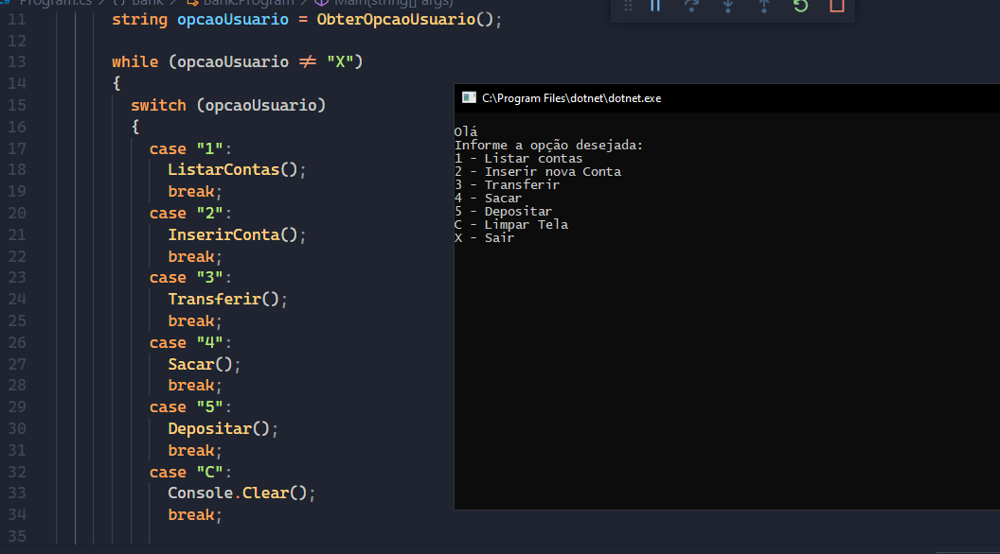

# Praticando C# e POO

Projeto com objetivo de mostrar como criar um algoritmo simples de transferência bancária para exercer o pensamento orientado a objetos, o principal paradigma de programação utilizada no mercado. Nesse projeto foi exercitado: Como pensar orientado a objetos, como modelar um domínio e como utilizar enums.

